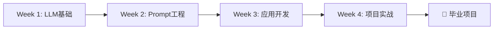

# 🚀 AI工程师训练营

## 从零开始，4周成为AI工程师

欢迎来到AI工程师训练营！这是一个为期**4周**的密集课程，专为想要快速掌握AI应用开发的工程师设计。无论你是否有编程基础，都能通过这个课程学会构建实用的AI应用。

---

## 💡 为什么选择这个课程？

  

    <h3>🎯 实战导向</h3>
    
每节课都包含实际项目，学完即可上手开发

  

  

    <h3>💰 成本优化</h3>
    
学会如何降低90%的API成本，避免账单爆炸

  

  

    <h3>🔧 完整工具链</h3>
    
掌握从模型选择到部署的完整技术栈

  

  

    <h3>👥 社区支持</h3>
    
加入Discord社群，与同学们一起学习成长

  

---

## 📅 课程大纲




  

    

      Lesson {{ lesson.order }}
      {{ lesson.duration }}
    

    <h3>
      <a href="{{ lesson.url | relative_url }}">{{ lesson.title }}</a>
    </h3>
    
{{ lesson.description }}

    

      
        📊 {{ lesson.difficulty }}
      
    

  



---

## 🎯 你将学到什么？

  

    <h3>🤖 LLM模型掌握</h3>
    <ul>
      <li>理解GPT、Claude、Gemini等模型特点</li>
      <li>学会根据场景选择最优模型</li>
      <li>掌握Token机制和成本优化</li>
    </ul>
  

  

    <h3>✍️ Prompt工程</h3>
    <ul>
      <li>Zero-shot/Few-shot学习</li>
      <li>Chain-of-Thought推理</li>
      <li>Prompt模板设计与优化</li>
    </ul>
  

  

    <h3>🔗 应用开发</h3>
    <ul>
      <li>使用LangChain构建应用</li>
      <li>实现RAG知识库系统</li>
      <li>部署生产级AI应用</li>
    </ul>
  

  

    <h3>🛠️ 实战项目</h3>
    <ul>
      <li>智能客服系统</li>
      <li>文档分析助手</li>
      <li>AI驱动的内容创作平台</li>
    </ul>
  

---

## 🛠️ 技术栈

  

    <h4>编程语言</h4>
    Python 3.11+
  

  

    <h4>AI平台</h4>
    OpenAI API
    Anthropic Claude
    Google Gemini
  

  

    <h4>框架</h4>
    LangChain
    Streamlit
    FastAPI
  

  

    <h4>数据库</h4>
    ChromaDB
    Pinecone
    PostgreSQL
  

---

## 📚 课程要求

### 必需条件
- 💻 一台能上网的电脑（Mac/Windows/Linux均可）
- 🔑 OpenAI API密钥（会指导如何申请）
- ⏰ 每周投入8-12小时学习时间

### 推荐背景
- 有基础编程经验（Python最佳，但不强制）
- 对AI应用开发感兴趣
- 愿意动手实践

### 不需要
- ❌ 深度学习理论知识
- ❌ 数学/统计学背景
- ❌ AI研究经验

---

## 🎓 学习路径

### Week 1: LLM生态认知
- Lesson 1: 认识LLM生态
- Lesson 2: Prompt工程基础

### Week 2: 深入应用
- Lesson 3: LangChain框架
- Lesson 4: 向量数据库与RAG

### Week 3: 高级技能
- Lesson 5: Agent开发
- Lesson 6: 模型微调

### Week 4: 生产部署
- Lesson 7: 应用部署
- Lesson 8: 综合项目

---

## 🚀 开始学习

  <a href="{{ '/lessons/lesson-01/' | relative_url }}" class="cta-button primary">
    📖 开始第一课
  </a>
  <a href="{{ site.social.github }}" class="cta-button secondary">
    ⭐ Star on GitHub
  </a>
  <a href="{{ site.social.discord }}" class="cta-button secondary">
    💬 加入Discord
  </a>

---

## 💬 常见问题

<strong>Q: 这个课程完全免费吗？</strong>

课程内容完全免费开源。但你需要自己准备OpenAI API密钥，会产生一些API调用费用（预计每周 $5-10）。

<strong>Q: 我没有编程基础可以学吗？</strong>

可以，但会比较有挑战。我们建议先学习Python基础（推荐资源见课程仓库）。如果你愿意投入时间，完全可以从零开始。

<strong>Q: 如何获得OpenAI API密钥？</strong>

访问 <a href="https://platform.openai.com" target="_blank">platform.openai.com</a>，注册账号后在API Keys页面创建。第一课会详细讲解。

<strong>Q: 完成课程后能做什么？</strong>

你将能够独立开发各种AI应用，如智能客服、文档分析工具、内容创作助手等。这些技能在当前就业市场非常抢手。

<strong>Q: 有结业证书吗？</strong>

完成所有作业并通过最终项目评审后，会获得课程结业证书（数字证书）。

---

## 👨‍🏫 关于讲师

[在这里添加你的简介、经验、项目等]

---

## 📞 联系我们

- 📧 Email: {{ site.email }}
- 💬 Discord: [加入社群]({{ site.social.discord }})
- 🐙 GitHub: [提Issue]({{ site.repository }})
- 🐦 Twitter: [@{{ site.social.twitter }}](https://twitter.com/{{ site.social.twitter }})

---

  
⭐ 如果觉得课程有帮助，请在GitHub上给我们一个Star！

  
📢 课程持续更新中，欢迎提供反馈和建议。

